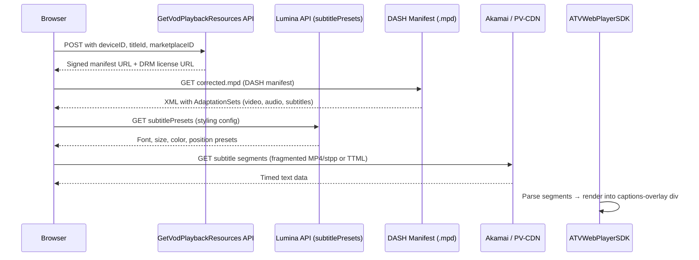

# How Amazon Prime Video Loads Subtitles

> **Live analysis** of your Reacher S1E1 session on `amazon.co.uk`

---

## The Complete Subtitle Pipeline



---

## Phase 1: Authentication & Playback Init

The player calls **`GetVodPlaybackResources`** (the "PRS" endpoint) to get everything needed for playback:

| Field | Captured Value |
|---|---|
| **Endpoint** | `https://atv-ps-eu.amazon.co.uk/playback/prs/GetVodPlaybackResources` |
| **Device ID** | `6cc49ad5-39ca-498a-b7eb-fe932caba245` |
| **Device Type** | `AOAGZA014O5RE` (Web browser) |
| **Marketplace** | `A1F83G8C2ARO7P` (UK) |
| **Title ID** | `amzn1.dv.gti.41f71162-2344-4089-accf-5ce0e9c12535` |
| **Player SDK** | `ATVWebPlayerSDK-1.0.237604.0` |

This response contains:
- **Signed manifest URL** for the DASH `.mpd` file
- **Widevine DRM license URL** for video/audio decryption
- **Available subtitle track metadata**

> [!IMPORTANT]
> This is the single most important API call. Without a valid authenticated session, the manifest URL is inaccessible.

---

## Phase 2: DASH Manifest Fetch

The player downloads the **MPD (Media Presentation Description)** manifest:

**Primary MPD (Akamai CDN):**
```
https://a257vod-dash-pv-ta-amazon.akamaized.net/
  3$0CiEIAhoFZW5fR0IgHzABUgaAwAKB8AN6A4C4F4IBAQGIAQQYAQ/
  ww_dub/4369/5fa6/e745/4c33-846a-515df0029a1b/
  ee116e70-64e2-4f75-8f16-693b59eb7d61_corrected.mpd
  ?amznDtid=AOAGZA014O5RE
  &amznPN=xp
  &amznPV=ATVWebPlayerSDK-1.0.237604.0
  &encoding=segmentBase
```

**Fallback MPD (Amazon PV-CDN):**
```
https://abmuwhzaaaaaaaamdcxdhbiznovuo.ta.pop-vod-dash.main.amazon.pv-cdn.net/
  dm/3$0CiMIAhoFZW5fR0IgHzABSAFSBoDAAoHwA3oDgLgXggEBAYgBBBgB/
  ww_dub/f667/cb42/9ef1/42a8-96e6-1dd6024cee8c/
  4fee8138-6c2d-4da8-ab31-675d59bc9a69_corrected.mpd
```

The MPD contained **100 AdaptationSets** total — covering multiple video resolutions, audio tracks, and subtitle languages.

> [!NOTE]
> The `_corrected.mpd` suffix indicates Amazon pre-processes manifests to fix timing/alignment issues before serving to clients.

---

## Phase 3: Subtitle Track Structure Inside the MPD

Subtitles in the MPD are encoded as **fragmented MP4 with TTML payload** (codec: `stpp` — Subtitles in ISO BMFF). This is the key finding:

```xml
<AdaptationSet
  contentType="text"
  mimeType="application/mp4"
  codecs="stpp"
  lang="en">
  <Representation id="subtitle_en" bandwidth="256">
    <SegmentBase indexRange="..." />
  </Representation>
</AdaptationSet>
```

### Why Amazon Uses `stpp` (not plain TTML/DFXP)

| Method | How It Works | Amazon's Choice |
|---|---|---|
| **Plain TTML/DFXP** | Single XML file download | ❌ Not used |
| **WebVTT** | Text-based, single file | ❌ Not used |
| **stpp (MP4 + TTML)** | TTML wrapped in fragmented MP4 segments | ✅ **Used** |

**Reason**: Wrapping TTML inside MP4 containers (`stpp`) allows subtitle segments to share the same **SegmentBase/SegmentTemplate** infrastructure as video and audio. This means:
- Subtitles can be **time-aligned** with video segments
- Same CDN caching/delivery infrastructure
- Easier DRM integration (though subtitle segments are typically unencrypted)

---

## Phase 4: Subtitle Styling via Lumina API

A separate call fetches subtitle **rendering presets**:

```
GET https://atv-ps-eu.amazon.co.uk/cdp/lumina/playerChromeResources/v1
  ?deviceID=6cc49ad5-39ca-498a-b7eb-fe932caba245
  &deviceTypeID=AOAGZA014O5RE
  &desiredResources=nextUpV2,reaction,regulatoryOverlayV2,subtitlePresets
  &entityId=amzn1.dv.gti.41f71162-2344-4089-accf-5ce0e9c12535
  &widgetScheme=pvplayer-web-v2
```

This returns JSON with:
- Font family, size, color, opacity
- Background color/opacity for subtitle boxes
- Edge style (drop shadow, raised, depressed)
- Position (percentage from bottom)

---

## Phase 5: Rendering — The DOM Overlay

Amazon does **NOT** use the browser's native `<track>` / `TextTrack` API. Our inspection confirmed:

```json
{
  "videoSrc": "blob/MSE",
  "textTrackCount": 0,
  "textTracks": []
}
```

Instead, the **ATVWebPlayerSDK** renders subtitles into a custom DOM overlay:

```html
<div class="atvwebplayersdk-captions-overlay f334kzc">
  <!-- Subtitle text dynamically injected here -->
</div>
```

The player's internal JavaScript:
1. Parses the `stpp` MP4 segments to extract TTML cue data
2. Maintains a timeline of `{begin, end, text}` entries
3. On each animation frame, checks `video.currentTime` against the timeline
4. Injects/removes `<span>` elements into the overlay div
5. Applies the Lumina subtitle presets for styling

---

## Phase 6: Available Languages (Captured)

The subtitle menu DOM revealed **24+ languages** available for Reacher:

| Language | Type |
|---|---|
| English CC | Closed Captions |
| العربية | Arabic |
| Català | Catalan |
| Čeština | Czech |
| Dansk | Danish |
| Deutsch | German |
| Ελληνικά | Greek |
| Español (Latinoamérica) | Spanish (LATAM) |
| Español (España) | Spanish (Spain) |
| Euskara | Basque |
| Suomi | Finnish |
| Filipino | Filipino |
| Français (Canada) | French (Canada) |
| Français (France) | French (France) |
| Galego | Galician |
| עברית | Hebrew |
| हिन्दी | Hindi |
| Magyar | Hungarian |
| Indonesia | Indonesian |
| Italiano | Italian |
| 日本語 | Japanese |
| ಕನ್ನಡ | Kannada |
| *...and more* | |

---

## CDN Infrastructure

| Domain | Purpose |
|---|---|
| `atv-ps-eu.amazon.co.uk` | Playback Resources API (PRS), Lumina, DRM licensing |
| `a257vod-dash-pv-ta-amazon.akamaized.net` | Primary CDN — DASH manifests & media segments (Akamai) |
| `*.ta.pop-vod-dash.main.amazon.pv-cdn.net` | Fallback CDN — Amazon's own PoP infrastructure |
| `ters-draper1.eu-west-1.aiv-delivery.net` | Telemetry & QoS reporting (Draper player metrics) |
| `global.telemetry.insights.video.a2z.com` | Global playback analytics |
| `fls-eu.amazon.co.uk` | Client-side logging & performance beacons |

---

## Summary: The Full Request Chain

```
1. Browser → atv-ps-eu: GetVodPlaybackResources (auth + title ID)
         ← Returns: signed MPD URL + DRM license URL

2. Browser → akamaized.net: GET .mpd manifest
         ← Returns: XML with 100 AdaptationSets (video/audio/subs)

3. Browser → atv-ps-eu: Lumina subtitlePresets
         ← Returns: JSON styling config

4. Browser → akamaized.net / pv-cdn.net: GET subtitle segments
         ← Returns: MP4 containers with embedded TTML (stpp codec)

5. ATVWebPlayerSDK: Parse stpp → extract TTML cues → render into
   <div class="atvwebplayersdk-captions-overlay"> in sync with video
```

> [!TIP]
> To see this yourself, open DevTools → Network tab → filter by `mpd` or `subtitle` or `lumina`. The `GetVodPlaybackResources` response (filter by `prs`) contains the complete subtitle track listing in its JSON payload.

---

## Recording of the Analysis


